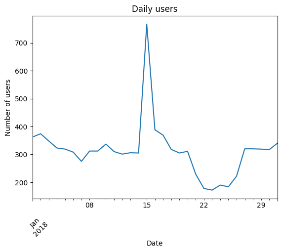
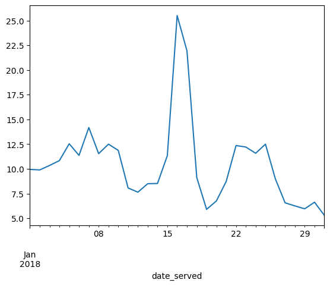
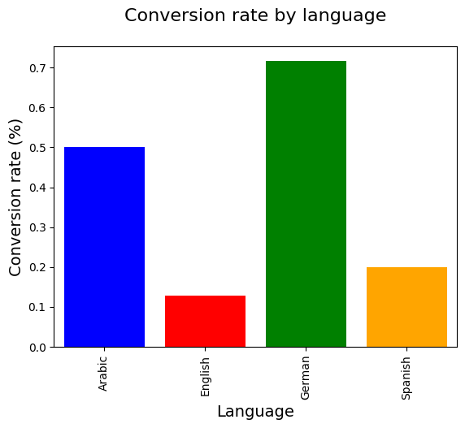

[](https://colab.research.google.com/drive/1CfV6yEsHBjFiJbTKwY72k2g4AvszcF5R)
[](https://share.streamlit.io/semasuka/credit-card-approval-prediction-classification/main/cc_approval_pred.py)
[](https://github.com/ellerbrock/open-source-badges/)

Badge [source](https://shields.io/)

# Key findings: The bug in the marketing campaign led to a loss of 32 potential subscribers to the business.


## Authors

- [@shannontorcato](https://www.github.com/shannontorcato)

## Table of Contents

  - [Business problem](#business-problem)
  - [Data source](#data-source)
  - [Methods](#methods)
  - [Tech Stack](#tech-stack)
  - [Quick glance at the results](#quick-glance-at-the-results)
  - [Lessons learned and recommendation](#lessons-learned-and-recommendation)
  - [Limitation and what can be improved](#limitation-and-what-can-be-improved)
  - [Run Locally](#run-locally)
  - [Explore the notebook](#explore-the-notebook)
  - [Deployment on streamlit](#deployment-on-streamlit)
  - [App deployed on Streamlit](#app-deployed-on-streamlit)
  - [Repository structure](#repository-structure)
  - [Contribution](#contribution)
  - [Blog post](#blog-post)
  - [Project featuring](#project-featuring)
  - [License](#license)


## Business problem

In this notebook we analyze a marketing campaign for a subscription based product. We look at different factors to check the effectivesness of the campaign while also looking to find anormalities and improvements we can make to it.

## Data source

- [DataCamp Marketing Campaign](https://www.datacamp.com/courses/analyzing-marketing-campaigns-with-pandas)

## Methods

- Exploratory data analysis
- Feature engineering
- Data visualization
- Summary statistics
- A/B Testing

## Tech Stack

- Python (refer to requirement.txt for the packages used in this project)
- pandas (data manipulation and analysis)
- numpy (mathematical operation on arrays)
- matplotlib (data visuaization)

## Analysis

1. **Overall performance of the campaign**: We can analyze the number of conversions, retention rates, and cancellations to understand how successful the campaign was. We can also calculate key performance indicators such as conversion rate, retention rate, and churn rate.

2. **Performance by marketing channel**: We can analyze how each marketing channel performed in terms of conversions, retention, and cancellations. We can also calculate conversion rates and retention rates for each channel.

3. **Performance by variant**: We can analyze how the personalization variant performed compared to the control group in terms of conversions, retention, and cancellations. We can also calculate conversion rates and retention rates for each variant.

4. **Performance by language**: We can analyze how each language performed in terms of conversions, retention, and cancellations. We can also calculate conversion rates and retention rates for each language.

5. **Performance by age group**: We can analyze how each age group performed in terms of conversions, retention, and cancellations. We can also calculate conversion rates and retention rates for each age group.

6. **Performance by day of week**: We can analyze how the campaign performed on each day of the week in terms of conversions, retention, and cancellations. We can also calculate conversion rates and retention rates for each day of the week.

7. **Performance by subscribing channel**: We can analyze how each subscribing channel performed in terms of conversions, retention, and cancellations. We can also calculate conversion rates and retention rates for each subscribing channel.

8. **Correct language displayed**: We can analyze how displaying the correct language affected conversions, retention, and cancellations. We can also calculate conversion rates and retention rates for the correct language displayed.


## Quick glance at the results

Line graph for number of user per day for the month of January.



Line graph for daily conversion rate.



Bar Graph showing the daily conversion rate grouped by language.



Top 3 models (with default parameters)

| Model     	                | Recall score 	|
|-------------------	        |------------------	|
| Support vector machine     	| 88% 	            |
| Gradient boosting    	        | 90% 	            |
| Adaboost               	    | 79% 	            |


- **The final model used for this project: Gradient boosting**
- **Metrics used: Recall**
- **Why choose recall as metrics**:
  Since the objective of this problem is to minimize the risk of a credit default, the metrics to use depends on the current economic situation:

  - During a bull market (when the economy is expanding), people feel wealthy and are employed. Money is usually cheap, and the risk of default is low because of economic stability and low unemployment. The financial institution can handle the risk of default; therefore, it is not very strict about giving credit. The financial institution can handle some bad clients as long as most credit card owners are good clients (aka those who pay back their credit in time and in total).In this case, having a good recall (sensitivity) is ideal.

  - During a bear market (when the economy is contracting), people lose their jobs and money through the stock market and other investment venues. Many people struggle to meet their financial obligations. The financial institution, therefore, tends to be more conservative in giving out credit or loans. The financial institution can't afford to give out credit to many clients who won't be able to pay back their credit. The financial institution would rather have a smaller number of good clients, even if it means that some good clients are denied credit. In this case, having a good precision (specificity) is desirable.

    ***Note***: There is always a trade-off between precision and recall. Choosing the right metrics depends on the problem you are solving.

    ***Conclusion***: Since the time I worked on this project (beginning 2022), we were in the longest bull market (excluding March 2020 flash crash) ever recorded; we will use recall as our metric.


 **Lessons learned and recommendation**

- Based on this project's analysis, income, family member headcount, and employment length are the three most predictive features in determining whether an applicant will be approved for a credit card. Other features like age and working employment status are also helpful. The least useful features are the type of dwelling and car ownership.
- The recommendation would be to focus more on the most predictive features when looking at the applicant profile and pay less attention to the least predictive features.

## Limitation and what can be improved

- Combine this model with with a regression model to predict how much of a credit limit an applicant will be approved for.
- Hyperparameter tuning with grid search or random search.
- Better interpretation of the chi-square test
- Retrain the model without the least predictive features


## Run Locally
Initialize git

```bash
git init
```


Clone the project

```bash
git clone https://github.com/semasuka/Credit-card-approval-prediction-classification.git
```

enter the project directory

```bash
cd Credit-card-approval-prediction-classification
```

Create a conda virtual environment and install all the packages from the environment.yml (recommended)

```bash
conda env create --prefix <env_name> --file assets/environment.yml
```

Activate the conda environment

```bash
conda activate <env_name>
```

List all the packages installed

```bash
conda list
```

Start the streamlit server locally

```bash
streamlit run cc_approval_pred.py
```
If you are having issue with streamlit, please follow [this tutorial on how to set up streamlit](https://docs.streamlit.io/library/get-started/installation)

## Explore the notebook

To explore the notebook file [here](https://nbviewer.org/github/semasuka/Credit-card-approval-prediction-classification/blob/main/Credit_card_approval_prediction.ipynb)

## Deployment on streamlit

To deploy this project on streamlit share, follow these steps:

- first, make sure you upload your files on Github, including a requirements.txt file
- go to [streamlit share](https://share.streamlit.io/)
- login with Github, Google, etc.
- click on new app button
- select the Github repo name, branch, python file with the streamlit codes
- click advanced settings, select python version 3.9 and add the secret keys if your model is stored on AWS or GCP bucket
- then save and deploy!

## App deployed on Streamlit


Video to gif [tool](https://ezgif.com/)
## Repository structure


```

├── assets
│   ├── confusion_matrix.png                      <- confusion matrix image used in the README.
│   ├── gif_streamlit.gif                         <- gif file used in the README.
│   ├── heatmap.png                               <- heatmap image used in the README.
│   ├── Credit_card_approval_banner.png           <- banner image used in the README.
│   ├── environment.yml                           <- list of all the dependencies with their versions(for conda environment).
│   ├── roc.png                                   <- ROC image used in the README.
│
├── datasets
│   ├── application_record.csv                    <- the dataset with profile information (without the target variable).
│   ├── credit_records.csv                        <- the dataset with account credit records (used to derive the target variable).
│   ├── test.csv                                  <- the test data (with target variable).
│   ├── train.csv                                 <- the train data (with target variable).
│
│
├── pandas_profile_file
│   ├── credit_pred_profile.html                  <- exported panda profile html file.
│
│
├── .gitignore                                    <- used to ignore certain folder and files that won't be commit to git.
│
│
├── Credit_card_approval_prediction.ipynb         <- main python notebook where all the analysis and modeling are done.
│
│
├── LICENSE                                       <- license file.
│
│
├── cc_approval_pred.py                           <- file with the model and streamlit component for rendering the interface.
│
│
├── README.md                                     <- this readme file.
│
│
├── requirements.txt                              <- list of all the dependencies with their versions(used for Streamlit).

```
## Contribution

Pull requests are welcome! For major changes, please open an issue first to discuss what you would like to change or contribute.

## License

MIT License

Copyright (c) 2022 Stern Semasuka

Permission is hereby granted, free of charge, to any person obtaining a copy
of this software and associated documentation files (the "Software"), to deal
in the Software without restriction, including without limitation the rights
to use, copy, modify, merge, publish, distribute, sublicense, and/or sell
copies of the Software, and to permit persons to whom the Software is
furnished to do so, subject to the following conditions:

The above copyright notice and this permission notice shall be included in all
copies or substantial portions of the Software.

THE SOFTWARE IS PROVIDED "AS IS", WITHOUT WARRANTY OF ANY KIND, EXPRESS OR
IMPLIED, INCLUDING BUT NOT LIMITED TO THE WARRANTIES OF MERCHANTABILITY,
FITNESS FOR A PARTICULAR PURPOSE AND NONINFRINGEMENT. IN NO EVENT SHALL THE
AUTHORS OR COPYRIGHT HOLDERS BE LIABLE FOR ANY CLAIM, DAMAGES OR OTHER
LIABILITY, WHETHER IN AN ACTION OF CONTRACT, TORT OR OTHERWISE, ARISING FROM,
OUT OF OR IN CONNECTION WITH THE SOFTWARE OR THE USE OR OTHER DEALINGS IN THE
SOFTWARE.

Learn more about [MIT](https://choosealicense.com/licenses/mit/) license